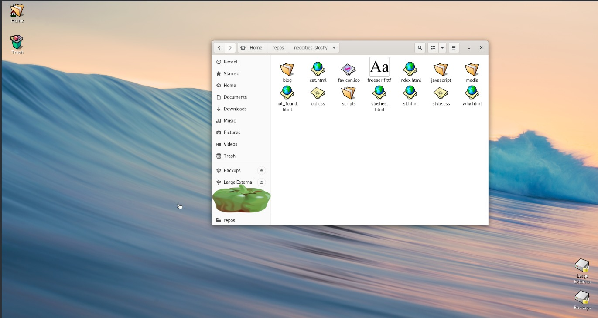

# Arion OS

> A personal computing operating system — fast, simple, powerful.
> **Powered by Coding Moves** ✦

---

## What is Arion OS?

Arion OS is a personal computing operating system. It is fast, simple to use, easy to learn, and yet very powerful.

Built as an experimental OS project by the **Coding Moves** team.

---

## References & Learning Resources

This project was built while studying the following resources:

- **Haiku OS Architecture** — Core kernel and desktop architecture reference.
- **The Little Book About OS Development** — Erik Helin, Adam Renberg (2015-01-19)
  [https://littleosbook.github.io/](https://littleosbook.github.io/)
- **Operating System Concepts** — Silberschatz, Galvin, Gagne
  [https://os.ecci.ucr.ac.cr/slides/Abraham-Silberschatz-Operating-System-Concepts-10th-2018.pdf](https://os.ecci.ucr.ac.cr/slides/Abraham-Silberschatz-Operating-System-Concepts-10th-2018.pdf)

---

## Boot Experience

### Boot Screen — Intro Splash


### Desktop



---

## Project Architecture

```
Arion OS
├── src/
│   ├── system/          # Kernel, boot loader, low-level system
│   │   ├── kernel/      # Core kernel (scheduler, memory, drivers)
│   │   ├── boot/        # Boot loader
│   │   └── runtime_loader/
│   ├── servers/         # System servers
│   │   ├── app/         # Application server (graphics, input)
│   │   ├── net/         # Network server
│   │   └── media/       # Media server
│   ├── apps/            # Built-in applications
│   │   ├── firstbootprompt/  # Boot splash + Arion branding
│   │   ├── haikudepot/       # Package manager
│   │   └── webpositive/      # Web browser
│   ├── kits/            # API kits (Interface, Storage, Network...)
│   └── libs/            # Shared libraries
├── headers/             # Public and private headers
├── data/                # System data, settings, artwork
├── build/               # Build system (Jam-based)
├── docs/                # Documentation and images
└── generated/           # Build output (ignored by git)
```

### Key Internals

| Component | Description |
|-----------|-------------|
| **Kernel** | Modular kernel with pluggable drivers |
| **App Server** | Handles rendering, window management, input |
| **Package System** | HPKG-based package management |
| **File System** | BFS with extended attributes support |
| **Boot Loader** | EFI + BIOS compatible |
| **Build System** | Custom Jam build system |

---

## Goals

- Sensible defaults with minimal configuration required.
- Clean, clear, concise code.
- Unified desktop environment.
- Custom Arion OS branding and unique boot experience.
- Educational OS development reference.

---

## Running Arion OS

Run in VirtualBox using the generated `.vmdk`:

1. VM type: `Other/Unknown (64-bit)`
2. RAM: `1024 MB`
3. Storage: Use existing `ArionOS.vmdk`
4. Graphics: `VBoxVGA`, `128 MB` video memory
5. System: `1 CPU`, Paravirtualization `None`

---

## Building from Source

**Requirements (WSL2/Linux):**
```bash
sudo apt install git nasm autoconf automake texinfo flex bison \
  gawk build-essential unzip zip mtools zstd python3 wget
```

**Why the cross-compiler?**
Arion OS targets its own kernel ABI. A standard Linux GCC cannot compile
OS-level code for this platform — we need a GCC configured specifically
for `x86_64-unknown-haiku`. The buildtools compile that cross-compiler
once, locally, and it is never uploaded or distributed.

**Build steps:**
```bash
# Build the cross-compiler (one time only)
git clone https://review.haiku-os.org/buildtools

# Configure
cd ArionOS
./configure --build-cross-tools x86_64 --cross-tools-source ~/buildtools

# Build Jam (the build system)
cd ~/buildtools/jam && make

# Build the OS image
HAIKU_REVISION=hrev57937_111 ~/buildtools/jam/bin.linuxx86/jam @vmware-image
```